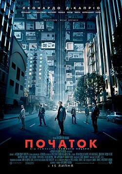
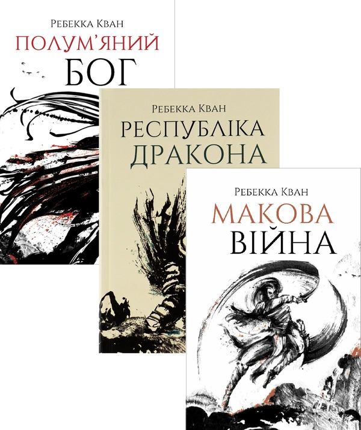
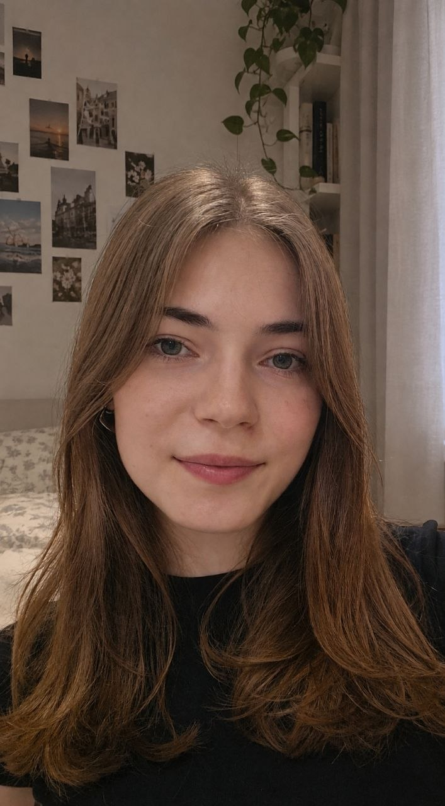

**Студентське портфоліо — «Основи web програмування»**
Козявіна Валерія Юріївна

---

## 1. HTML-розмітка

### 1.1. Метадані та базова структура документа

**Додано:** коректний DOCTYPE, мова документа, кодування, viewport, favicon і три Open Graph теги.

```html
<!DOCTYPE html>
<html lang="uk">
<head>
    <meta charset="UTF-8">
    <meta name="viewport" content="width=device-width, initial-scale=1">
    <title>Валерія Козявіна — студентське портфоліо</title>
    <meta name="description" content="Особисте портфоліо студентки...">
    <link rel="icon" href="img/favicon.png" type="image/png">
    <meta property="og:title" content="Валерія Козявіна — студентське портфоліо">
    <meta property="og:description" content="Особисте портфоліо студентки...">
    <meta property="og:image" content="img/og-cover.jpg">
    <link rel="stylesheet" href="css/style.css">
</head>
```

### 1.2. Семантичні елементи

**Додано:** header, nav, main, section, figure/figcaption, footer, address, details/summary, blockquote/cite.

```html
<header class="header">...</header>
<nav class="nav" aria-label="Основна навігація">
    <details class="nav__toggle">
        <summary class="nav__toggle-btn" aria-label="Відкрити меню">☰ Меню</summary>
        <ul class="nav__list">...</ul>
    </details>
</nav>

<figure class="travel__figure">
    
    <figcaption class="travel__caption">Київ. Києво-Печерська лавра</figcaption>
</figure>

<blockquote class="quotes__quote">
    <p>«Хаос — це не провалля. Хаос — це драбина.»</p>
    <cite class="quotes__author">— Джордж Р. Р. Мартін</cite>
</blockquote>
```


### 1.3. Заголовки

**Додано:** рівно один `<h1>` (ім'я в hero-секції), далі тільки `<h2>` для заголовків секцій і `<h3>` для підзаголовків, без пропущених рівнів і без `<h4>`.

### 1.4. Таблиця (фільми)

**Додано:** таблиця з `caption`, `thead`, `tbody` та `th scope="col"`.

```html
<table class="movies__table">
    <caption class="movies__caption">Фільми та серіали з особистою оцінкою за IMDb</caption>
    <thead>
    <tr>
        <th scope="col">Постер</th>
        <th scope="col">Назва</th>
        <th scope="col">Рік</th>
        <th scope="col">Оцінка IMDb</th>
    </tr>
    </thead>
    <tbody>
    <tr>
        <td></td>
        <td>Початок</td><td>2010</td><td>8.8</td>
    </tr>
    ...
    </tbody>
</table>
```

### 1.5. Зображення

**Додано:** у всіх `` проставлені `alt`, `width`, `height`, `loading="lazy"`; декоративні іконки мають `alt=""`.

```html



```


```html
<picture class="hero__photo-wrap">
    <source media="(min-width: 768px)" srcset="img/me.jpg">
    
</picture>
```

### 1.6. Форма зворотного зв'язку

**Додано:** поля з `label for`, атрибутами `required`, `type="email"` з `pattern`, `minlength`, `<select>`, `<textarea>` і чекбокс згоди.

```html
<label class="contacts__label" for="email">E-mail</label>
<input class="contacts__input" type="email" id="email" name="email" required
       pattern="[^@\s]+@[^@\s]+\.[a-zA-Z]{2,}">

<select class="contacts__select" id="subject" name="subject" required>
    <option value="">Оберіть тему</option>
    <option value="project">Співпраця / проєкт</option>
</select>

<input class="contacts__checkbox" type="checkbox" id="consent" name="consent" required>
```


## 2. CSS

### 2.1. Mobile first та медіа-запити

**Додано:** базові стилі без медіа-запитів відповідають мобільному макету, всі брейкпойнти підключені тільки через `min-width`.

```css
@media (min-width: 768px) { ... }
@media (min-width: 1200px) { ... }
```

### 2.2. CSS-змінні та теми

**Додано:** 38 змінних у `:root` (кольори, відступи, радіуси, тіні, шрифти, ширина контенту); темна тема через `prefers-color-scheme` з перевизначенням лише змінних.

```css
:root {
    --color-bg: #F3F5FA;
    --color-accent: #555D82;
    --color-accent-2: #8FA0C7;
    --radius-md: 0.875rem;
    --shadow-md: 0 12px 30px rgba(85, 93, 130, 0.16);
    --space-md: 1.25rem;
    --content-width: 74ch;
}

@media (prefers-color-scheme: dark) {
    :root {
        --color-bg: #0E111C;
        --color-text: #E6E9F5;
        --color-accent: #7E88B8;
    }
}
```

### 2.3. Flexbox і CSS Grid

**Додано:** Flexbox — навігація, hero, форма; Grid з `auto-fit`/`minmax` — сітки хобі та книг.

```css
.hobbies__grid { grid-template-columns: repeat(auto-fit, minmax(8.75rem, 1fr)); }
.books__grid   { grid-template-columns: repeat(auto-fit, minmax(13.75rem, 1fr)); }
```

### 2.4. Адаптивна типографіка

**Додано:** `clamp()` застосовано на `h1`, `h2`, `h3` і на базовому розмірі тексту `body`.

```css
body { font-size: clamp(1rem, 0.94rem + 0.3vw, 1.125rem); }
h1 { font-size: clamp(2.1rem, 1.6rem + 2.4vw, 3.4rem); font-weight: 700; }
h2 { font-size: clamp(1.5rem, 1.3rem + 1.2vw, 2.15rem); font-weight: 600; }
```

### 2.5. Псевдокласи та псевдоелементи

**Додано:** `:hover` — 10 разів, `:focus-visible` — 7, `:active` — 3, `:nth-child` — 5, `:not` — 4, `::before` — 5, `::after` — 8.

```css
.hobbies__card:nth-child(3n) { border-color: var(--color-accent); }
.facts__item:nth-child(even) { color: var(--color-text); }
.goals__item:not(:last-child) { border-bottom: 1px dashed var(--color-border); }
.hero::before { content: ''; background: radial-gradient(...); }
```

### 2.6. Transition та keyframes-анімація

**Додано:** 9 властивостей `transition` по коду і одна `@keyframes`-анімація появи hero-блоку, вимкнена при `prefers-reduced-motion`.

```css
@keyframes fade-up {
    from { opacity: 0; transform: translateY(1rem); }
    to   { opacity: 1; transform: translateY(0); }
}

@media (prefers-reduced-motion: reduce) {
    *, *::before, *::after {
        animation-duration: 0.001ms !important;
        transition-duration: 0.001ms !important;
        scroll-behavior: auto !important;
    }
}
```

### 2.7. Sticky, position, scroll

**Додано:** sticky-шапка, кілька елементів з `position: absolute/relative`, плавний скрол і `scroll-margin-top` під висоту шапки.

```css
.header { position: sticky; top: 0; z-index: 50; }
html { scroll-behavior: smooth; }
main > section { scroll-margin-top: calc(var(--header-height) + var(--space-sm)); }
```

### 2.8. Іменування класів

**Додано:** методологія BEM витримана по всьому файлу (`contacts__field--checkbox`, `skills__bar-fill--85`, `nav__toggle-btn`); CSS-фреймворки не підключалися.

---

## 3. Три макети та брейкпойнти (480 / 768 / 1200 px)

### 3.1. Навігація

**Додано:** мобільний — приховане меню через `details`/`summary`; планшет — горизонтальний ряд посилань під логотипом; десктоп — горизонтальне меню в один рядок зі sticky-шапкою.

```css
/* мобільний (базово) */
.nav__list { display: flex; flex-direction: column; ... }

/* 768px */
.nav__toggle summary { display: none; }
.nav__list { flex-direction: row; flex-wrap: wrap; width: 100%; }

/* 1200px */
.header__inner { flex-direction: row; align-items: center; }
.nav__list { width: auto; justify-content: flex-end; }
```

### 3.2. Секція «Про мене»

**Додано:** мобільний — фото над текстом по центру; планшет — фото ліворуч/текст праворуч через Flexbox; десктоп — Grid у три колонки (фото / текст / бічна панель контактів).

```css
/* мобільний */
.hero__inner { display: flex; flex-direction: column; align-items: center; }

/* 768px */
.hero__inner { flex-direction: row; flex-wrap: wrap; text-align: left; }

/* 1200px */
.hero__inner {
    display: grid;
    grid-template-columns: auto 1fr auto;
    gap: var(--space-2xl);
}
.hero__contacts { flex-direction: column; align-items: flex-start; }
```

### 3.3. Галерея подорожей

**Додано:** мобільний — горизонтальний скрол з `scroll-snap`; планшет — сітка 2×N; десктоп — «мозаїка» з `grid-column`/`grid-row span` на окремих картках.

```css
/* мобільний */
.travel__gallery {
    display: flex;
    overflow-x: auto;
    scroll-snap-type: x mandatory;
}

/* 768px */
.travel__gallery { display: grid; grid-template-columns: repeat(2, 1fr); }

/* 1200px */
.travel__gallery { grid-template-columns: repeat(4, 1fr); grid-auto-rows: 13rem; }
.travel__figure:nth-child(1) { grid-column: span 2; grid-row: span 2; }
.travel__figure:nth-child(4) { grid-row: span 2; }
```

### 3.4. Сітки карток (хобі, книги)

**Додано:** 1 колонка на мобільному, 2 на планшеті, 3–4 на десктопі.

```css
/* базово */ .books__grid { grid-template-columns: repeat(auto-fit, minmax(13.75rem, 1fr)); }
/* 768px */ .books__grid { grid-template-columns: repeat(2, 1fr); }
/* 1200px */ .books__grid { grid-template-columns: repeat(3, 1fr); }
/* 1200px */ .hobbies__grid { grid-template-columns: repeat(4, 1fr); }
```

---

## 4. Доступність

**Додано:** видимий фокус через `:focus-visible` на всіх інтерактивних елементах, `aria-label` та `aria-current` на активному пункті меню, `role="progressbar"` з `aria-valuenow/min/max` на шкалах навичок.

```css
a:focus-visible, button:focus-visible, input:focus-visible,
select:focus-visible, textarea:focus-visible, summary:focus-visible {
    outline: 0.1875rem solid var(--color-accent-2);
    outline-offset: 0.1875rem;
}
```
```html
<span class="skills__bar" role="progressbar" aria-valuenow="85"
      aria-valuemin="0" aria-valuemax="100" aria-label="C++ / C#: 85%">
```


## 7. Використання ШІ

Інструмент: Claude (Anthropic). Використовувався як довідник для написання й перевірки CSS-фрагментів — не для генерації файлів повністю, а для окремих частин верстки, перелічених нижче. Кожен залишений фрагмент коду перенесено вручну в `style.css`.

### 7.1. Градієнти

Використано для градієнтного тексту заголовка hero та фонових радіальних градієнтів (hero, body), а також для градієнтної кнопки форми.

```css
.hero__name {
    background: linear-gradient(90deg, var(--color-accent), var(--color-accent-2));
    -webkit-background-clip: text;
    background-clip: text;
    color: transparent;
}

body {
    background:
        radial-gradient(ellipse at top, color-mix(in srgb, var(--color-accent) 12%, transparent), transparent 60%),
        var(--color-bg);
}

.contacts__submit {
    background: linear-gradient(120deg, var(--color-accent), var(--color-accent-2));
}
```

### 7.2. Вигляд шкал навичок

Використано для верстки прогрес-барів навичок: заповнена смуга поверх фону-підкладки, ширина через модифікатор-клас, плавна transition при зміні ширини.

```css
.skills__bar {
    position: relative;
    width: 100%;
    height: 0.625rem;
    background: var(--color-bg-alt);
    border-radius: var(--radius-sm);
    overflow: hidden;
}
.skills__bar-fill {
    position: absolute;
    inset: 0 auto 0 0;
    height: 100%;
    background: linear-gradient(90deg, var(--color-accent), var(--color-accent-2));
    transition: width 0.6s ease;
}
.skills__bar-fill--85 { width: 85%; }
```

### 7.3. Оформлення цитат

Використано для декоративної лапки над блоком цитати через `::before` та стилізації `<cite>` окремо від основного тексту.

```css
.quotes__quote {
    position: relative;
    padding: var(--space-lg) var(--space-md) var(--space-md);
    background: var(--color-bg-alt);
    border-radius: var(--radius-md);
}
.quotes__quote::before {
    content: '“';
    position: absolute;
    top: -0.2rem;
    left: var(--space-md);
    font-size: 3.5rem;
    color: var(--color-accent);
    opacity: 0.5;
}
.quotes__quote p { font-family: var(--font-display); font-style: italic; }
```

### 7.4. Меню (бургер без JS)

Використано для приховування маркера `<summary>` за замовчуванням, стрілки-індикатора стану через `::after` і повороту стрілки при відкритому `<details>`.

```css
.nav__toggle summary { cursor: pointer; list-style: none; }
.nav__toggle summary::-webkit-details-marker { display: none; }
.nav__toggle-btn::after {
    content: '▾';
    color: var(--color-accent);
    transition: transform 0.2s ease;
}
.nav__toggle[open] .nav__toggle-btn::after { transform: rotate(180deg); }
```

### 7.5. Розташування фото в розділі «Подорожі» на телефоні, планшеті й ноутбуці

Використано для трьох різних способів показу однієї й тієї ж галереї залежно від ширини екрана: скрол-стрічка на мобільному, рівна сітка на планшеті, мозаїка з об'єднаними клітинками на десктопі.

```css
/* телефон: горизонтальний скрол */
.travel__gallery {
    display: flex;
    gap: var(--space-md);
    overflow-x: auto;
    scroll-snap-type: x mandatory;
}
.travel__figure { flex: 0 0 78%; scroll-snap-align: start; }

/* планшет: сітка 2×N */
@media (min-width: 768px) {
    .travel__gallery { display: grid; grid-template-columns: repeat(2, 1fr); }
    .travel__photo { height: 16rem; }
}

/* ноутбук/десктоп: мозаїка */
@media (min-width: 1200px) {
    .travel__gallery { grid-template-columns: repeat(4, 1fr); grid-auto-rows: 13rem; }
    .travel__figure:nth-child(1) { grid-column: span 2; grid-row: span 2; }
    .travel__figure:nth-child(4) { grid-row: span 2; }
}
```

### 7.6. Таблиця з фільмами

Використано для зебри-рядків, виділення рядка при наведенні і стилізації шапки таблиці окремим шрифтом.

```css
.movies__table th {
    background: var(--color-bg-alt);
    font-family: var(--font-display);
    font-weight: 600;
}
.movies__table tbody tr:nth-child(even) { background: var(--color-bg-alt); }
.movies__table tbody tr:hover {
    background: color-mix(in srgb, var(--color-accent) 12%, var(--color-surface));
}
```

Увесь текстовий контент розділів, підбір книг/фільмів/музики та структура HTML написані без участі ШІ. ШІ залучався виключно до перелічених вище фрагментів CSS.
